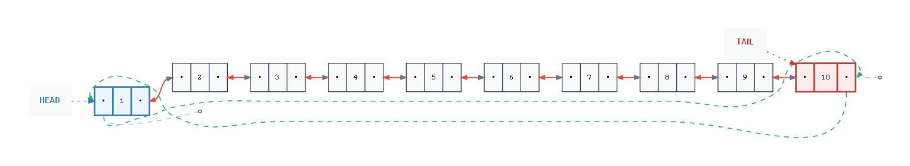

# ds-double-linked-list

Implementación de **Double Linked List**, **Double Circular List** y **Double Circular List por Composición** en C++ desde cero, usando templates, punteros, manejo manual de memoria y pruebas unitarias con Google Test.

## Demo



### Requisitos para la visualización

Instalar Graphviz:

**Windows (ejecutable oficial):**
Descargar desde https://graphviz.org/download/ y marcar "Add Graphviz to PATH" durante la instalación.

**Windows (MSYS2/pacman):**
```bash
pacman -S mingw-w64-ucrt-x86_64-graphviz
```

**Linux:**
```bash
sudo apt install graphviz
```

Verificar instalación:
```bash
dot -V
```

Correr el ejecutable principal genera los `.dot` y `.png` automáticamente en `outputs/`:
```bash
./ds_double_linked_list
```

## Estructuras implementadas

| Estructura | Archivo | Descripción |
|-----------|---------|-------------|
| `Node<T>` | `include/Node.h` | Nodo base con dato, `next` y `prev` |
| `List<T>` | `include/List.h` | Clase abstracta con interfaz común |
| `DoubleLinkedList<T>` | `include/DoubleLinkedList.h` | Lista doblemente enlazada |
| `DoubleCircularList<T>` | `include/DoubleCircularList.h` | Lista doblemente enlazada circular |
| `DoubleCircularListComposition<T>` | `include/DoubleCircularListComposition.h` | Lista circular por composición sobre `DoubleLinkedList<T>` |

## Decisiones de diseño

- Todas las estructuras usan **templates** `<typename T>` para soportar cualquier tipo de dato
- `DoubleLinkedList` y `DoubleCircularList` heredan de `List<T>` permiten **polimorfismo** via puntero padre
- `DoubleCircularListComposition` usa **composición** sobre `DoubleLinkedList` no hereda, solo expone operaciones semánticas (`insertFront`, `insertBack`, `removeFront`, `removeBack`, `rotate`)
- `operator<<` definido en `List<T>` como `friend` delega a `print(os)` virtual, polimórfico automáticamente
- `print(os)` es `protected` en cada clase hija no expuesto al usuario, solo usado por `operator<<`
- `searchNode(position)` busca desde el extremo más cercano O(n/2) en el peor caso
- `DoubleCircularList` mantiene `tail->next = head` y `head->prev = tail` en todo momento
- Constructor de copia estándar obligatorio cuando se define constructor templado de conversión
- `operator=` con `reinterpret_cast` para auto-asignación entre tipos diferentes

## Complejidad

| Operación | DoubleLinkedList | DoubleCircularList | Composición |
|-----------|-----------------|-------------------|-------------|
| Insert inicio | O(1) | O(1) insertFront | O(1) insertFront |
| Insert final | O(1) | O(1) insertBack | O(1) insertBack |
| Insert medio | O(n/2) | O(n/2) | — |
| Remove inicio | O(1) | O(1) removeFront | O(1) removeFront |
| Remove final | O(1) | O(1) removeBack | O(1) removeBack |
| Remove medio | O(n/2) | O(n/2) | — |
| Search | O(n) | O(n) | — |
| SearchPos inicio/final | O(1) | O(1) front/back | O(1) front/back |
| SearchPos medio | O(n/2) | O(n/2) | — |
| Rotate | — | — | O(1) |

## Estructura del proyecto

```
ds-double-linked-list/
├── .clangd
├── .gitignore
├── CMakeLists.txt
├── README.md
├── main.cpp
├── include/
│   ├── List.h
│   ├── Node.h
│   ├── DoubleLinkedList.h
│   ├── DoubleCircularList.h
│   └── DoubleCircularListComposition.h
├── source/
│   ├── Node.tpp
│   ├── DoubleLinkedList.tpp
│   ├── DoubleCircularList.tpp
│   └── DoubleCircularListComposition.tpp
├── outputs/
│   └── .gitkeep
└── test/
    ├── Node/
    │   └── NodeTest.cpp
    ├── DoubleLinkedList/
    │   └── DoubleLinkedListTest.cpp
    ├── DoubleCircularList/
    │   └── DoubleCircularListTest.cpp
    └── DoubleCircularListComposition/
        └── DoubleCircularListCompositionTest.cpp
```

## Requisitos

- C++20 o superior
- CMake 4.1+
- CLion o cualquier compilador g++/clang++
- Google Test (instalado via `pacman -S mingw-w64-ucrt-x86_64-gtest` en Windows/MSYS2)

## Compilar y ejecutar

> Si usas CLion, el build es automático. Para compilar manualmente desde terminal:

```bash
mkdir cmake-build-debug && cd cmake-build-debug
cmake ..
cmake --build .
```

Ejecutar programa principal:
```bash
./ds_double_linked_list
```

Ejecutar tests individuales:
```bash
./test_node
./test_double_linked_list
./test_double_circular_list
./test_double_circular_list_composition
```

Ejecutar todos los tests con CTest:
```bash
ctest
```

## Tests

| Suite | Tests | Estado |
|-------|-------|--------|
| `NodeTest` | 7 | ✅ |
| `DoubleLinkedListTest` | 30 | ✅ |
| `DoubleCircularListTest` | 29 | ✅ |
| `DoubleCircularListCompositionTest` | 18 | ✅ |
| **Total** | **84** | ✅ |

## Topics

`data-structures` `linked-list` `double-linked-list` `circular-list` `cpp` `templates` `cmake` `googletest` `algorithms`